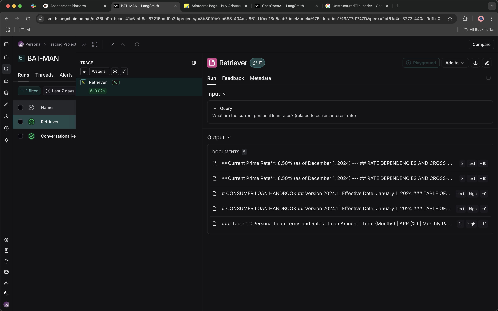
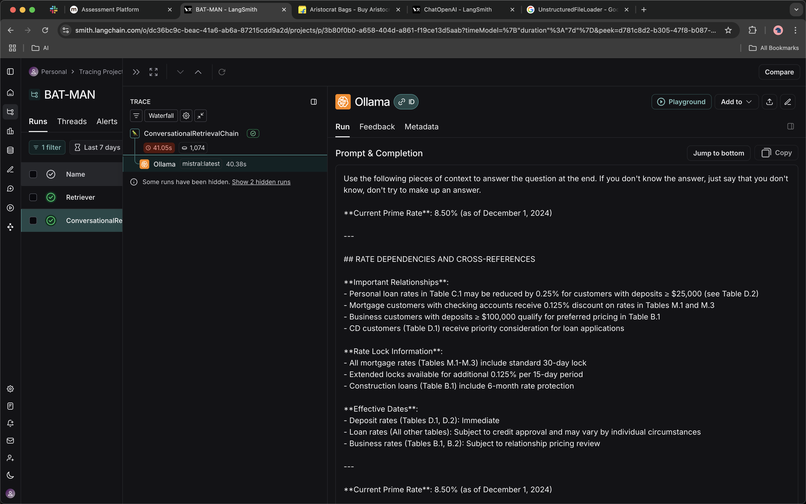

# Banking RAG System with LangChain & LangSmith

## 🔍 Evaluation Framework

The system includes comprehensive evaluation via LangSmith:

- **Banking Accuracy**: Validates numerical data (APR rates, terms)
- **Table Context**: Ensures table relationships are preserved
- **Cross-References**: Tests "See Table X" resolution
- **Compliance**: Regulatory requirement validation

## 📸 Screenshots & Examples

### LangSmith Evaluation Dashboard

*LangSmith evaluation dashboard showing banking RAG system performance metrics*

### System Performance Metrics  

*Detailed performance and cost analysis metrics*

## 🎯 Cost Analysis

See `docs/cost_analysis.md` for detailed cost optimization strategies comparing:
- Premium setup (GPT-4 + cloud)
- Optimized setup (local models)
- Hybrid approaches

